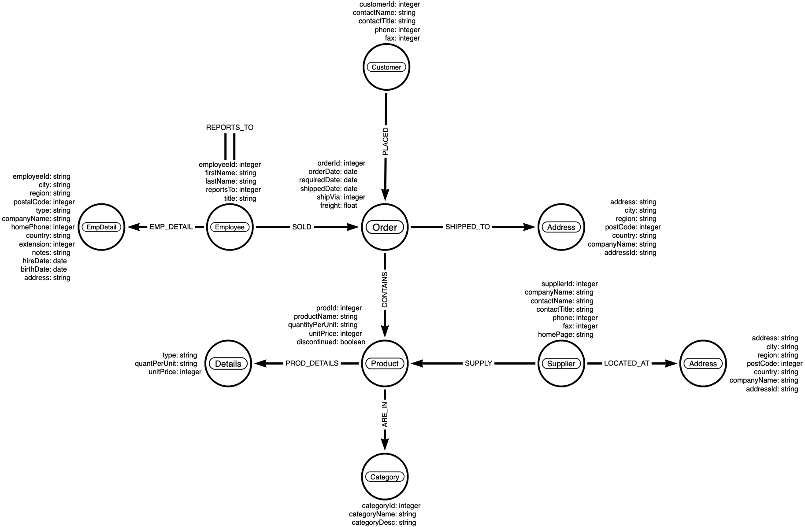
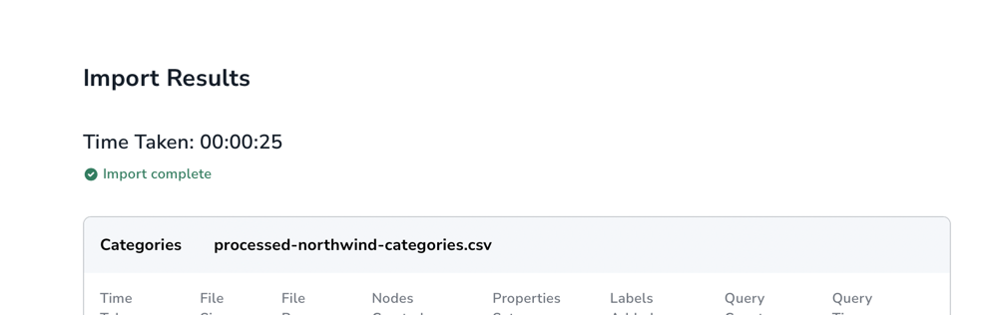
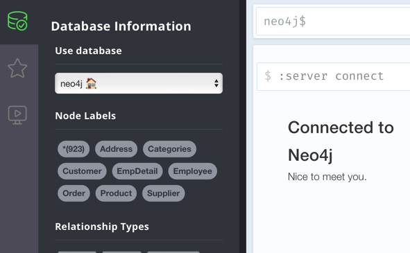
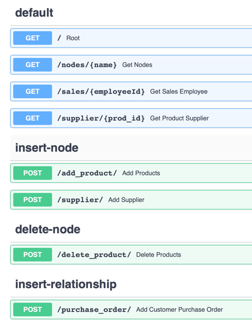

# Demo Application – Neo4j and FastAPI

Demo application that uses FastAPI and Neo4j.

The demo application uses neo4j and FastAPI. Data is modelled and then ingested into Neo4j Graph database using the
Neo4j Data Importer and the FastAPI endpoint are used to query the Neo4j database.

*** 

## Use Case

Northwind dataset is used for this demo application. Northwind dataset can be accessed via the below link:

https://gist.github.com/maruthiprithivi/072b526e20fe16a29f98db07f569861d

The dataset has the following entities – Orders, Employee, Customer, Product, Supplier and Categories. The data
relationship are as follows:

- Customer – place - order
- Orders have products
- Suppliers supply products
- Products are in different categories
- Orders are shipped to an Address
- Suppliers located at a particular address

***

## Data Model

Arrow App is used to create a Graph data model. The json export of the data model can be found in directory.



***

## Neo4j Data Importer UI

Neo4j Data importer can be used to import small datasets, model and ingest data into Neo4j database.

Neo4j Data importer can be accessed via below link:

https://data-importer.graphapp.io


The data is ingested into Neo4j database by running the data importer.

***

## Neo4j browser graph app

Neo4j browser app can be used to run Cypher queries.

https://browser.graphapp.io

***

## Application Tree Structure

```
app-neo4j-fastapi/
├── .env
├── .gitignore
├── __init__.py
├── config.py
├── cypher-queries/
│   └── cypher.txt
├── files/
│   ├── processed-northwind-categories.csv
│   ├── processed-northwind-customers.csv
│   ├── processed-northwind-employees.csv
│   ├── processed-northwind-orders.csv
│   ├── processed-northwind-products.csv
│   ├── processed-northwind-suppliers.csv
│   └── processed-northwond-order-details.csv
├── images/
│   ├── api-endpoints.png
│   ├── data-importer-status.png
│   ├── data-importer.png
│   ├── data-model.png
│   └── neo_sandbox.png
├── LICENSE
├── main.py
├── models/
│   └── models.py
├── neo4j_importer_model.json
├── pandas.ipynb
├── README.md
└── requirements.txt

```

## Setup

The application uses Python 3.9.13.

The setup process involves the following steps:

1. Clone the repo on local
   ```git clone ```
2. Create and activate virtual environment - venv

```bash
# Create venv
python3 -m venv venv

# Activate venv
source venv/bin/activate
```

3. Install requirements.txt

```bash
pip install -r requirements.txt
```

4. Create Blank Database in Neo4j AuraDB - https://neo4j.com/cloud/platform/aura-graph-database/?ref=nav-get-started-cta
   1. Down the credentials file if needed for reference


6. Import the Data Model JSON in Data Importer UI - https://data-importer.graphapp.io
   1. Add files from `/files` folder
   2. Open model `neo4j_importer_model.json`

7. Run Data Importer to ingest data into Neo4j database



8. Go back to the Neo4j AuraDB console and click Explore
   1. This will open `https://browser.neo4j.io`
   2. Enter the credentials 
   3. Select the neo4j database 



10. Set Neo4j BOLT URL, username, password and database in ``.env`` file
11. Run FastAPI application

```bash
uvicorn main:app --reload
```

12. Access Swagger UI

- http://127.0.0.1:8000/
- http://127.0.0.1:8000/docs
- http://127.0.0.1:8000/redoc

13. Perform CRUD operations using the API endpoints



***

## Docker Image
The application can be run using the Dockerfile.

To start the Docker service
- Set the credentials in ``/app/.env`` file
- Run the docker compose ``docker compose up``


